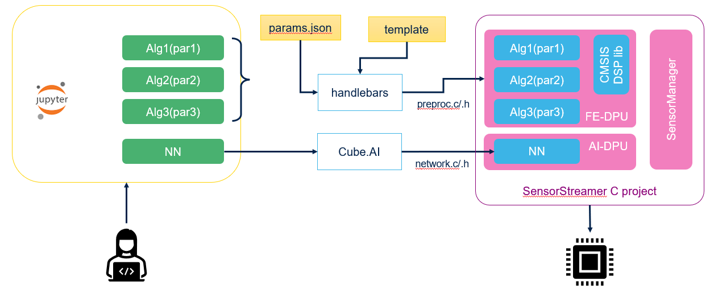

# Embedded AI course @ PoliMi

This repository contains material used for the embedded AI Ph.D. course @ Polimi.

The course is based on evaluation boards and material made available by STMicroelectronics.

Attendees can use a VMWare image where all SW is pre-installed, as explained [here](VM/README.md).

## Data logging

Data acquisition from MEMS sensors uses [STWIN boards](https://www.st.com/en/evaluation-tools/steval-stwinkt1.html) and [High Speed Datalogger firmware](https://www.st.com/en/embedded-software/fp-sns-datalog1.html).

With this setup it is possible to collect sensor data from triaxial accelerometers, microphones, pressure sensorand magnetometers. Logged data can be analyzed by using the HSD Python SDK, as shown in the following example notebooks.

* [Data logging](datalog.ipynb)
* [Data visualization](dataviz.ipynb)
* [Data tagging](tagging.ipynb)

## Data analysis

* [MFCC feature extraction](contrib/DATA_Analysis/MFCC/MFCC_Calculation_and_analysis.ipynb)

## AI models for microcontrollers
Mapping AI models to C code to be executed in a microcontroller makes useof the following packages.

* [Cube.AI](https://www.st.com/content/st_com/en/support/learning/stm32-education/stm32-moocs/Introduction_to_STM32CubeAI_MOOC.html) is a tools that translates Keras, Tensorflow and ONNX AI models into C, suitable to be executed on STM32 microcontrollers.
* [FP-AI-MONITOR1](https://www.st.com/en/embedded-software/fp-ai-monitor1.html) is a firmware project that can read sensor data  and feed a Neural Network generated with Cube.AI.

## Mapping neural networks on STWIN

