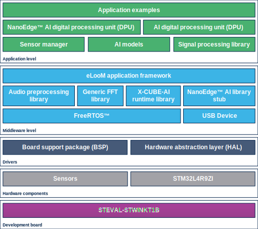

::: {.row}
::: {.col-sm-12 .col-lg-4}

# Release Notes for FP-AI-MONITOR1
Copyright &copy; 2021 STMicroelectronics
    
{.logo}

# Purpose
The **FP-AI-MONITOR1** function pack helps to jump-start the implementation and development for sensor-monitoring-based
applications designed with the **X-CUBE-AI** Expansion Package for **STM32Cube** or with the NanoEdge&trade; AI Studio. It covers the
entire design of the Machine Learning cycle from the data set acquisition to the integration on a physical node.
X-CUBE-AI is an STM32Cube Expansion Package part of the STM32Cube.AI ecosystem and extending **STM32CubeMX**
capabilities with automatic conversion of pre-trained Neural Network or Machine Learning models and integration of generated
optimized library into the user's project. The X-CUBE-AI Expansion Package offers also several means to validate AI models
both on desktop PC and STM32, as well as measure performance on STM32 devices without user handmade ad hoc C code.
The support vector classifier used for human activity recognition (HAR) example is generated by X-CUBE-AI. Other applications
can be created using ML and DNN code generated by X-CUBE-AI.
NanoEdge&trade; AI Studio simplifies the creation of autonomous Machine Learning libraries with the possibility of running training on
target and inference on the edge. For instance, condition-based monitoring applications using vibration and motion data can be
created easily by re-compiling the function pack with NanoEdge&trade; AI anomaly detection models.
**FP-AI-MONITOR1** runs learning session and the inference in real time on an **STM32L4R9ZI** ultra-low-power microcontroller
(Arm&reg; Cortex&reg;M4 at 120 MHz with 2 Mbytes of Flash memory and 640 Kbytes of SRAM), taking physical sensor data as input.
The SensorTile wireless industrial node (**STEVAL-STWINKT1B**) embeds industrial-grade sensors, including 6-axis IMU, 3-axis
accelerometer and vibrometer to record any inertial and vibrational data with high accuracy at high frequencies.
The NanoEdge&trade; AI library generation itself is out of the scope of this function pack and must be generated using NanoEdge&trade;
AI Studio.
**FP-AI-MONITOR1** implements a wired interactive CLI to configure the node, and manage the learn and detect phases. For
simple operation in the field, a standalone battery-operated mode allows basic controls through the user button, without using
the console.

\

Here is the list of references to the user documents:

-   [X-CUBE-AI ](https://www.st.com/en/embedded-software/x-cube-ai.html)
-   [STEVAL-STWINKT1B](https://www.st.com/en/evaluation-tools/steval-stwinkt1b.html)
-   [User manual](https://wiki.st.com/stm32mcu/wiki/FP-AI-MONITOR1_user_manual )
-   [Quick Start Guide](https://wiki.st.com/stm32mcu/wiki/AI:FP-AI-MONITOR1_getting_started)
-   [NanoEdge Studio](https://www.st.com/en/embedded-software/nanoedge-ai-8482.html#overview NanoEdge AI Studio)

:::

::: {.col-sm-12 .col-lg-8}
# Update history

::: {.collapse}
<input type="checkbox" id="collapse-section4" checked aria-hidden="true">
<label for="collapse-section4" aria-hidden="true">__v1.0.0 / 15 September 2021__</label>

			

## Main changes

### First release
- Complete firmware to program an STM32L4+ sensor node for sensor-monitoring-based applications on the STEVALSTWINKT1B
SensorTile wireless industrial node
- Runs classical Machine Learning (ML) and Artificial Neural Network (ANN) models generated by the X-CUBE-AI, an
STM32Cube Expansion Package
- Runs NanoEdge&trade; AI libraries generated by NanoEdge&trade; AI Studio for AI-based sensing applications. Easy integration by
replacing the pre-integrated stub
- Application example of human activity classification based on motion sensors
- Application binary of high-speed datalogger for STEVAL-STWINKT1B data record from any combination of sensors and
microphones configured up to the maximum sampling rate on a microSD&trade; card
- Sensor manager firmware module to configure any board sensors easily, and suitable for production applications
- eLooM (embedded Light object-oriented fraMework) enabling efficient development of soft realtime, multi-tasking, eventdriven
embedded applications on STM32L4+ Series microcontrollers
- Digital processing unit (DPU) firmware module providing a set of processing blocks, which can be chained together, to
apply mathematical transformations to the sensors data
- Configurable autonomous mode controlled by user button
- Interactive command-line interface (CLI):
   - Node and sensor configuration
   - Configure application running either an X-CUBE-AI ML or ANN model, or a NanoEdge&trade; AI Studio model with learn-and-detect capability

## Contents

<small>The components flagged by "[]{.icon-st-update}" have changed since the
previous release. "[]{.icon-st-add}" are new.</small>

Components

  Name                            Version           Release note
  ------------------------------- ----------------- -------------------------------------------------------------------------------------------------------------------------
  Application examples            V1.0.0            [release note](Projects/STM32L4R9ZI-STWIN/Applications/FP-AI-MONITOR1/Release_Notes.html)
  Digital Processing Unit         V1.0.0            [release note](Projects/STM32L4R9ZI-STWIN/Applications/FP-AI-MONITOR1/DPU/Release_Notes.html)
  Sensor Manager                  V1.0.0            [release note](Projects/STM32L4R9ZI-STWIN/Applications/FP-AI-MONITOR1/SensorManager/Release_Notes.html)
  Signal Processing Librarie      V1.0.0            [release note](Projects/STM32L4R9ZI-STWIN/Applications/FP-AI-MONITOR1/signal_processing_lib/Release_Notes.html)

  : Applications
\

  Name                            Version           Release note
  ------------------------------- ----------------- -------------------------------------------------------------------------------------------------------------------------
  eLooM application framework     V3.0.0            [release note](Middlewares/ST/eLooM/Release_Notes.html)
  Audio preprocessing librarie    V1.1.2            [release note](Middlewares/ST/STM32_AI_AudioPreprocessing_Library/Release_Notes.html)
  Generic FFT libarie             V1.0.0            [release note](Middlewares/ST/STM32_GenericFFT_Library/Release_Notes.html)
  X-CUBE-AI runtime libary        V7.0.0            [link to X-CUBE-AI](https://www.st.com/en/embedded-software/x-cube-ai.html)
  NanoEdge AI libary stub         V2.1.0            [release note](Middlewares/ST/NanoEdge_AI_Library/Release_Notes.html)
  STM32 USB Device Library        V2.7.1            [release note](Middlewares/ST/STM32_USB_Device_Library/Release_Notes.html)
  FreeRTOS                        V10.2.1           [release note](Middlewares/Third_Party/FreeRTOS/Source/st_readme.txt)

  : Middleware
\

  Name                            Version           Release note
  ------------------------------- ----------------- -------------------------------------------------------------------------------------------------------------------------
  STM32L4xx CMSIS                 V1.7.1            [release note](Drivers/CMSIS/Device/ST/STM32L4xx/Release_Notes.html)
  STM32L4xx HAL                   V1.13.0           [release note](Drivers/STM32L4xx_HAL_Driver/Release_Notes.html)
 
  : Drivers
\

  Name                            Version           Release note
  ------------------------------- ----------------- -------------------------------------------------------------------------------------------------------------------------
  Common                           V6.0.0           [release note](Drivers/BSP/Components/Common/Release_Notes.html)
  adau1978                         V1.0.1           [release note](Drivers/BSP/Components/adau1978/Release_Notes.html)
  hts221                           V5.2.3           [release note](Drivers/BSP/Components/hts221/Release_Notes.html)
  iis2dh                           V1.0.4           [release note](Drivers/BSP/Components/iis2dh/Release_Notes.html)
  iis2mdc                          V1.0.2           [release note](Drivers/BSP/Components/iis2mdc/Release_Notes.html)
  iis3dwb                          V1.0.4           [release note](Drivers/BSP/Components/iis3dwb/Release_Notes.html)
  ism330dhcx                       V1.0.2           [release note](Drivers/BSP/Components/ism330dhcx/Release_Notes.html)
  stts751                          V1.0.2           [release note](Drivers/BSP/Components/stts751/Release_Notes.html)
  lps22hh                          V1.1.2           [release note](Drivers/BSP/Components/lps22hh/Release_Notes.html)
  
  : Components
\

## Known limitations

-   none

## Development toolchains and compilers
-	STM32CubeIDE v1.7.0
-	IAR 8.50.9
-	KEIL 5.31

## Supported devices and boards
- [STEVAL-STWINKT1B](https://www.st.com/en/evaluation-tools/steval-stwinkt1b.html)

## Backward compatibility

-   none

## Dependencies

-   none

:::

:::
:::

<footer class="sticky">
::: {.columns}
::: {.column width="95%"}
For complete documentation on **\<SW or product family name\>** ,
visit: [[\<SW or product family URL\>](http://www.st.com/STM32)]{style="background-color: yellow;"}
:::
::: {.column width="5%"}
<abbr title="Based on template cx566953 version 2.1">Info</abbr>
:::
:::
</footer>
