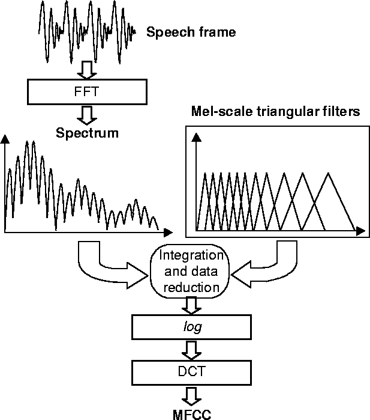

# CMSIS DSP Library Python Wrapper functions for signal pre-processing

In the following functions the variable names is defined as follow:

- n_samples : number of samples to consider in the window
- shift_samples : number of samples for overlapping the windows


<br>
<br>
<br>

## <ins>Support functions</ins>

Functions called internally by the other main callable functions

<br>

### complexABS

Performing the real FFT function included in the CMSIS DSP Library of signal with a length of **n_samples** it calculates the spectrum storing the result in an output array with a length of **n_samples**. 
The spectrum array is composed by **output=[ real[0] , img[0], real[1] , img[1] , ... , real[n_samples/2] , img[n_samples/2] ]**

Then this function can be used to calculate the spectrum real amplitude

```{python}
def complexABS( real,  compl):
  return np.sqrt(real*real + compl*compl)
```

<br>

### dot_product

this function calculates the dot product between two arrays **in_1** and **in_2**

```{python}
def dot_product_ARM(in_1, in_2):
  mult = dsp.arm_mult_f32(in_1,in_2)
  sum = 0
  for i in range(len(mult)):
    sum = sum + mult[i]
  return sum
```


<br>

### Hz -  Mel conversion functions

This functions are used to convert the spectrum axis from **Hz** to **Mel** scale and vice versa. The [mel scale](https://en.wikipedia.org/wiki/Mel_scale) is mainly used for audio application to better represent how human ear the sound.

```{python}
def Hz_to_Mel(f_hz):
  return(2595*np.log10(1+f_hz/700))

def Mel_to_Hz(f_mel):
  return(700*(10**(f_mel/2505)-1))
```

<br>

### Triangular Mel Filterbank generator

This function generates a defined number (**nfilt**) of [triangular filters](https://www.google.it/url?sa=i&url=https%3A%2F%2Flabrosa.ee.columbia.edu%2Fdoc%2FHTKBook21%2Fnode54.html&psig=AOvVaw0odKO6IQZWe4YaS7oiqVGh&ust=1651653732868000&source=images&cd=vfe&ved=0CAwQjRxqFwoTCNiCkOn3wvcCFQAAAAAdAAAAABAJ) equispaced in mel frequency domain between **f_min** and **f_max**


```{python}
def Mel_filters(nfilt, f_min, f_max, sample_rate, n_samples ):
  low_freq_mel=Hz_to_Mel(f_min)
  high_freq_mel=Hz_to_Mel(f_max)

  d_hz_points = (high_freq_mel-low_freq_mel)/(nfilt+2)
  hz_points = np.zeros(nfilt+2)
  bin_sep=sample_rate/n_samples
  bin = np.zeros(nfilt+2)
  for ii in range(nfilt+2):
    hz_points[ii] = Mel_to_Hz((low_freq_mel + ii * d_hz_points))
    bin[ii] =  np.round(hz_points[ii]/bin_sep)

  #initialize filterbank
  fbank=np.zeros((nfilt,int(np.floor(n_samples/2))))
  for m in range(1,nfilt+1):
    f_m_minus=int(bin[m-1])
    f_m=int(bin[m])
    f_m_plus=int(bin[m+1])

    for k in range(f_m_minus, f_m):
      fbank[m-1,k]=(k-f_m_minus)/(f_m-f_m_minus)
    for k in range(f_m,f_m_plus):
      fbank[m-1,k]=(f_m_plus-k)/(f_m_plus-f_m)
  return fbank
```


<br>
<br>
<br>

## <ins>Power spectrum</ins>

This function calculates the Power Spectrum using the **arm_real_fft** function. The input signal must have a defined length of 256, 512, 1024, 2048, etc... in order to be performed. The **status** variable check is all the set input parameters are correct, if **status==1** it means that the power spectrum calculation can be performed.


```{python}
def CMSIS_PowerSpectrum (signal, sampling_frequency):
  # insert a signal with a lenght of 512, 1024, 2048, etc... 
  n_samples = len(signal)
  rfftf32=dsp.arm_rfft_fast_instance_f32()
  status=dsp.arm_rfft_fast_init_f32(rfftf32,n_samples)

  resultI = dsp.arm_rfft_fast_f32(rfftf32,signal,0)

  power_spectrum = np.zeros(int(n_samples/2))
  freq_point = 0

  for ii in range(0, int(n_samples) ,2):
    power_spectrum[freq_point] = complexABS( resultI[ii],  resultI[ii+1])
    power_spectrum[freq_point] = power_spectrum[freq_point]/np.sqrt(n_samples)
    power_spectrum[freq_point] = 2 *power_spectrum[freq_point] **2 / sampling_frequency
    freq_point = freq_point+1

  return power_spectrum
```

<br>
<br>
<br>

## <ins>Power spectrogram</ins>

This function calculates the Power Spectrogram matrix and it uses the Power Spectrum calculated using the previous function. The input signal can have any length and it will be sliced into **N** windows composed by **n_samples** which must have specific values as mentioned above: 512, 1024, 2048, etc...
The **shift_samples** input variable can be used to overlap the windows.

The output of this function generates a matrix with a dimension of **[n_samples/2 , N]**.

```{python}
def CMSIS_PowerSpectrogram(signal, sampling_frequency, n_samples = 2048, shift_samples=256):
    n_samples_tot =int(signal.shape[0])

    N=0
    while (n_samples_tot-(N*shift_samples+n_samples)) > 0:
        N=N+1

    spectrogram_matrix = np.zeros((int(n_samples/2), N))
    window = sig.hanning(n_samples)
    for ii in range(N):
        sub_signal = signal[ int(ii*shift_samples) : int(ii*shift_samples + n_samples) ]
        sub_signal = window*sub_signal
        spectrogram_matrix[: , ii] = CMSIS_PowerSpectrum(sub_signal, sampling_frequency)
    
    return spectrogram_matrix
```

<br>
<br>
<br>

## <ins>Mel Spectrogram & Mel Coefficients</ins>

In the following image is described the process to extract the Mel Frequency Cepstrum Coefficients starting from a signal. The functions **MFCC_Spectrogram** generates a matrix containing for each column the MFCC extracted from the related signal window over time. 




<br>

### Mel Spectrum

```{python}
def mel_spectrum_ARM(fbank,  power_spectrum):
  mel_spectrum = np.zeros(128)
  for ii in range(fbank.shape[0]):
    mel_spectrum[ii] = dot_product_ARM(fbank[ii,:], power_spectrum)  
  return mel_spectrum
```

<br>

### Mel Spectrogram

Description of the most important input parameters:

- **signal**: input signal with any length 
- **freq_min**: minimum frequency from which the Filterbank is calculated
- **numOfMelFilters**: it must have a specific lenght due to some limitation of the CMSIS DSP Library function, the suggested value is 128
- **numOfDctOutputs** : num of the output MFCC, value from 0 to numOfMelFilters
- **n_samples** : signal slice length
- **shift_samples**: overlapping samples between two windows

<br>

```{python}
def CMSIS_MFCC_Spectrogram_V4(signal,sampling_frequency, freq_min = 0, numOfDctOutputs=13, numOfMelFilters = 128 , n_samples = 2048, shift_samples=256):
    n_samples_tot =int(signal.shape[0])
    N=0
    while (n_samples_tot-(N*shift_samples+n_samples)) > 0:
        N=N+1

    mcc_spectrogram_matrix = np.zeros((numOfDctOutputs, N))
    
    freq_high = sampling_frequency * 0.45
    fbank = Mel_filters(128, 0, freq_high, sampling_frequency, n_samples)
    cfftradix4f32=dsp.arm_cfft_radix4_instance_f32()
    rfftf32=dsp.arm_rfft_instance_f32()
    dct4f32=dsp.arm_dct4_instance_f32()
    status=dsp.arm_dct4_init_f32(dct4f32,rfftf32,cfftradix4f32,numOfMelFilters,int(numOfMelFilters/2),0.125)

    window = sig.hanning(n_samples)

    for ii in range(N):
        sub_signal = np.array(signal[ii*shift_samples : ii*shift_samples + n_samples])
        sub_signal = sub_signal - np.mean(sub_signal)
        sub_signal = sub_signal*window
        power_spectra = CMSIS_PowerSpectrum (sub_signal, sampling_frequency)
        mel_spectra = mel_spectrum_ARM(fbank,  power_spectra)
        mel_spectra = 20*np.log10(mel_spectra)

        state=np.zeros(int(2*numOfMelFilters))
        resultI = dsp.arm_dct4_f32(dct4f32,state,mel_spectra)
        mcc_spectrogram_matrix[:,ii]=resultI[0:numOfDctOutputs]

    return mcc_spectrogram_matrix
```